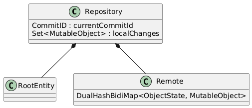

# TreeTools

This project is a **Git-like version control system** for Java data models, enabling users to automatically track changes
across different copies of the same model, with only minimal modifications to the data model needed. This allows **thread-safe manipulation** as well as offering
a range of other features related to tracking, saving and restoring states of a data model.  
The system leverages **reflections** and **aspect-oriented programming (AOP)** to allow these features to work for **arbitrary**
data models defined within the provided framework, with only minor restrictions. Once tracking is enabled for a defined
data model, any changes made to the model are detected and tracked automatically, with no explicit logging or function
calling required.

## Features

- Automatic tracking and synchronization of changes across different workcopies of a data model using operations like
  **commit** and **pull**
- Ability to save states and use **redo/undo** operations
- Automatic cloning (deep copying) of the data model
- JSON serialization and deserialization
- Wrapper mechanism to attach decorator objects to data model classes, with the ability to get notified when the underlying object changes or is removed

All these features are available while allowing the creation of highly complex data models including the use of:
- Abstract classes
- Weak and circular references
- Polymorphic parents (classes that can have different owner types depending on its location in the model structure)
- Arbitrary data types (including custom immutable objects)
- Collections, Maps, Arrays and direct references to other data model classes (Lists not possible)
- Usage of data model classes as map keys

Limitations:
- Object's lifetimes are coupled to owner
- container can only hold ``MutableObject``s
- Lists are not supported

## Getting Started

To use TreeTools for your data model, I recommend creating your data model as a separate project. This is because
TreeTools uses **AOP** and **compile-time weaving** to inject additional code into your data model classes at compile time
to allow the automatic tracking of changes. By separating your data model into its own project, you can build it as a
local library, which, being prebuilt, contains the modified code.

To use TreeTools for your data model, build it as a `mavenLocal`
artifact and import it:

1. Clone the TreeTools repository:
    ```bash
    git clone https://github.com/Daniel63656/TreeTools.git
    ```

2. Navigate to the project directory and run the publishToMavenLocal gradle task:
    ```bash
    cd ArpackJ
    ./gradlew publishToMavenLocal
    ```
3.  Create a dedicated project and move your data model to it. Modify the `build.gradle` file to allow aspectJ weaving:

    ```gradle
    plugins {
        id 'java-library'      // Project is a library 
        id 'maven-publish'     // Used for publishing to maven local
        id 'io.freefair.aspectj' version '6.4.3'  // Add the freefair aspectJ plugin
    }
    
    repositories {
        mavenLocal()           // TreeTools will be imported from local repository
        ...
    }
    
    // Tell aspectJ plugin where to look for classes that may need weaving
    sourceSets.main.aspectj.srcDir "src/main/java"
    sourceSets.test.aspectj.srcDir "src/test/java"
    // Configure path of woven classes
    compileAspectj {
        destinationDirectory.set(new File("build\\classes\\java\\main"))
        println "destinationDirectory = " + destinationDirectory.get()
    }
   
    dependencies {
        implementation group: 'net.scoreworks', name: 'TreeTools', version: '1.1.0'
        ....
    }
    
    // For publishing data model as local library
    java {
        withSourcesJar()   // Provide .java classes in sources.jar
    }
    publishing {
        publications {
            mavenJava(MavenPublication) {
                from components.java
            }
        }
    }
    ```
    
4. In your main project, it is enough to import your data model after publishing:
    ```gradle
    repositories {
        mavenLocal()           // Don't forget to add mavenLocal again as repository
        ...
    }
   
    dependencies {
        implementation group: 'com.example', name: 'YourDataModel', version: 'some.version.number'
        ....
    }
    ```

For an in-depth tutorial on how to set up your data model classes to work with TreeTools see the dedicated [Tutorial](TUTORIAL.md).

## Usage
### Engage Transactions

Changes made to a data model are not tracked by default. This enables the user to use transactions (that come
with some overhead), only where needed. To enable transactions for your data model, get an instance of the global
`TransactionManager` and enable transactions for your data model:
```java
TransactionManager tm = TransactionManager.getInstance();
tm.enableTransactionsForRootEntity(originalModelRootInstance);
```
Under the hood, the system will now create a `Repository` for your data model's `RootEntity`. A repository acts as a wrapper
that connects your data model with a special two-way map, referred to as `Remote`, that connects each data model object
to an immutable object state that is detached from actual object changes.
Any local changes made to the data model are tracked by the remote. Only when `commit()` is called, these local changes
are packaged as `Commit` and the `Remote` gets updated.



> **Note:**
> Engaging transactions will index the classes of your data model once using reflections. If your data model violates the
> data model requirements of this system, an `IllegalDataModelException` will be thrown. Indexing also happens when using
> other features, such as JSON serialization.

Now that transactions are properly set up, we can use the system to create a deep copy of the original data model. This is
particularly useful for enabling another thread to read the copy—for example, for a view—while allowing the original data
model to be modified concurrently. We obtain such a copy by using the `clone()` method. This will create a separate 
data model inclusive separate `Repository` and `Remote`.
```java
workcopyRoot = (RootClass) tm.clone(originalModelRootInstance);
```

Now we can operate on the original model, while the workcopy can be safely accessed. After some changes are made, they
can be committed to the remote. Our workcopy is still not modified by this.
```java
originalModelRootInstance.commit();
```

To synchronize the workcopy with the recently committed changes, our reading thread should call `workcopyRoot.pull()`
at regular intervals (e.g. before drawing). This will fetch available commits from the `TransactionManager` and apply the changes to the workcopy.
Congratulations, the workcopy is now up to date with the original data model!

### Undos and Redos

We can use the `TransactionManager` again to enable the usage of undos/redos:
```java
tm.enableUndoRedos();
```

Now you can archive a version of the data model by calling `tm.createUndoState()`. Under the hood, the `TransactionManager`
will keep a squash commit around, that captures all the commited changes since the last undo state (or beginning of transactions).
Use `originalModelRootInstance.undo()` and `originalModelRootInstance.redo()` to visit these preserved states.  
Changes introduced to the original data model by undo/redo can be pulled by workcopies like any other commit.

### Disengage Transactions

If you want to stop using transactions you should call `tm.shutdown()` to properly remove all references to workcopies
and commits.

### JSON parsing


This project also supports the serialization and deserialization of your data model, enabling you to save it externally,
such as in a database. This functionality can be used independently of the transaction system.
To create a JSON string from your data model, simply call:
```java
String json = JsonParser.toJson(fullScore, true);   // Using pretty printing
```
To load a data model from a json string, use the `JsonParser`:
```java
RootClass root = JsonParser.fromJson(json, RootClass.class);
```

### Wrapper Classes

In practice, data models are often used in different domains that require additional data to be associated with data model
classes. This is often achieved using a **Decorator pattern** or **wrapper class**. Let's imagine your data model is
used in some kind of view and therefore needs to store additional view-specific data with concrete data model objects.
However, these wrappers also need to be informed when the underlying object changes or gets deleted (for example to recompute
a layout or visual attributes).
TreeTools provides a special wrapper mechanism for that. Every **MutableObject** extends a special **Wrappable** interface which
allows for the creation of wrappers that observe state changes of the wrapped class.  
To create a wrapper class, simply extend the ``Wrapper<Type>`` base class with the specific data class type you want to wrap.
You can access the wrapped object using the ``getWrapped()`` getter. You also can override the ``onWrappedRemoved()`` and
``onWrappedChanged()`` functions to listen to state changes and the deletion of the wrapped object. Once a wrapper class is not needed anymore,
it can be removed using the ``remove()`` function.  
To instantiate a wrapper, both the wrapped class and a ``WrapperScope`` are required. ``WrapperScope``s act as "categories"
for a specific wrapper domain and provide direct access to all wrappers of this scope. For our running view example, let's
create a ``WrapperScope`` that represents the view. This class will contain a map that saves our view-specific wrappers.
It should exist as long as we want to use the view (e.g. survive configuration changes):
```java
public class ViewScope implements WrapperScope {
    // WrapperScope must provide the underlying map that maps wrappers to their wrapped objects
    private final Map<MutableObject, Wrapper<?>> registeredWrappers = new HashMap<>();
    
    @Override
    public Map<MutableObject, Wrapper<?>> getRegisteredWrappers() {
        return registeredWrappers;
    }

    // It is good practise to add the wrapper to the RootEntity in the constructor
    public WrapperScope(FullScore fullScore) {
        fullScore.addWrapperScope(this);
    }
}
```
``WrapperScopes`` are saved in the data model's ``RootEntity``. Therefore, it is good practice to add the created scope class
to the model root upon creation.  
With a scope created, we can now instantiate wrapper classes. Data model classes can access attached wrappers of a specific
scope using
the ``getRegisteredWrapper(WrapperScope scope)`` function.  
A data model can have an arbitrary number of specific domains (each contributing a ``WrapperScope`` instance). Because all
wrappers are saved in the corresponding ``WrapperScope``, simply calling ``removeWrapperScope(WrapperScope scope)`` in the
``RootEntity`` is enough to remove all references to wrappers of this domain.

See ``treetools/WrapperTests`` in the test source set for a complete code example.
