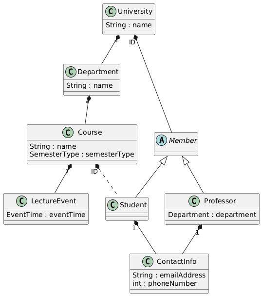
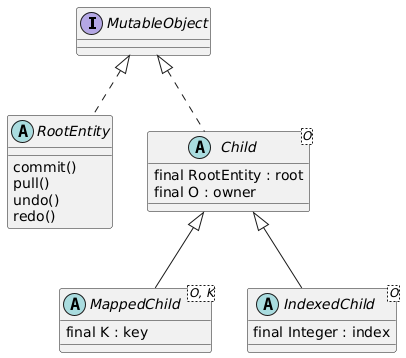

# Creating an Example Model with TreeTools

This tutorial demonstrates how to set up a data model for use with the TreeTools system and provides practical examples
of how to work with it effectively. To do so, different features will be introduced gradually by building the following
toy model:



The code for the data model can be found in the `examplemodel` module.

### Mutable Objects and Basic Data Model Classes

The main function of TreeTools is to track changes to data model classes automatically, so they can be reproduced on other
workcopies, reverted or undone. To do so, the system introduces a special `MutableObject` interface, that all data model
classes must inherit to mark them as part of the tracked data model.  
To do so, TreeTools provides four dedicated classes that your data model classes must inherit, depending on its position
in the overall data model:

- `RootEntity`: Root of the data model. Each data model has exactly one class of this type. Transactional methods like **commit()** and **pull()** are called on this type.
- `Child`: Every other class has an owner and therefore must inherit this type. The owner type must be provided as generic type. More concrete variants are:
- `MappedChild`: Child that is owned in a map by the owner.
- `IndexedChild`: Child that is owned in an array by the owner.

Internally, all these types implement the `MutableObject` interface.



TreeTools relies on fields like `owner`, `key` and `index` to clearly define the position of an object in the data model,
acting as **unique identifiers** for any given `MutableObject`. As such, these attributes must be present at construction,
which is enforced with appropriate constructors in the `Child` types. This also means, that these classes can not be used
outside the data model (e.g. as temporary data types), they must always be constructed by adding them to a concrete owner.  
In the current version of TreeTools, these fields can not change over the lifetime of an object, they are **final**.

The next Chapters will gradually introduce these four different types and how to use them on the example model. If you want
to set up your own data model, I recommend reading xxx getting started xxx first.

### Set up
aspectJ -> EntityStateListener
build.gradle
separate module to limit compile time weaving (only applies to data model classes anyway)

### Model Root

Every data model starts with a clearly defined **root** type, in this case `University`. To mark `University` as the model
root, it must extend the `RootEntity` type. A data model can have only one class of this type. This class is the only of the four
base types that does not need a dedicated constructor as it has no owner.

### Creating the first Child

Data models are mostly hierarchical data structures of classes, where child classes are owned in some kind of container
field (collection, map, array) or as a direct reference if it is a single child.  
In our example, we observe that `University` holds a set of `Department`s so let's create this class next.
As explained before, every other mutable data model except the `RootEntity` needs to have a clearly defined **owner**.
This is made clear to the system by extending the `Child` class and providing the owner (in this case `University`) as generic type:
```java
public class Department extends Child<University> {...}
```
This does prompt us to override two abstract functions `addToOwner()` and `removeFromOwner()` as well as a basic constructor.
Since the transactional system does not know the concrete field in `University` where `Departments` are stored in, but
must still be able to add and remove departments to, for example, reproduce changes we make in another workcopy, each
system needs to provide adding and removing itself from its owner
in these two functions. The owner can be obtained with the `getOwner()` method of `Child`. You can see these functions
implemented in the `Department` class. The system will use these two functions to reproduce creation or deletion of `Child`
classes.  
Next, let's look at the basic constructor:
```java
protected Department(University owner) {
    super(owner);
}
```
In this case, we want to use a different custom constructor that also provides a `name` attribute. This public constructor will be
used in practise to initialize the `Department` class:
```java
public Department(University parent, String name) {
    super(parent);      // Call superclass (Child) constructor
    addToOwner();       // This must be called by every public constructor eventually!!!
    // Do other class specific things...
    this.name = name;
}
```


The second constructor can be left protected. Importantly, this constructor can not be removed as it is used **by the
transactional system** to create classes. Therefore, each `Child` class needs a constructor that takes only the owner
as input parameter. If we remove this constructor, the system will throw an `IllegalDataModelException` complaining that
"Department has no suitable constructor". To avoid somebody removing this constructor because it seems to be unused, it
is best practise to mark it with the `TransactionalConstructor` annotation.  
If our class happens to have no other non-child attributes,
one can also directly use this constructor by making it public. In this case, don't forget to add itself to the owner:
```java
    @TransactionalConstructor
public Department(University owner) {
    super(owner);
    addToOwner();   // Don't forget this line or otherwise, Departments created manually will not be added to owner!
}
```

### Mapped Children

`University` also contains `Member`s, albeit mapped with an ID as key. This makes the ID a necessary part of any construction,
as it is needed to add it to its owner. This necessitates a special derivation of `Child` called `MappedChild`, that takes
an owner and a key as construction parameters:
```java
public abstract class Member extends MappedChild<University, Integer> {...}
```
This is an abstract class, but we still implement `addToOwner()` and `removeFromOwner()` here, since it is the same for
`Student` and `Professor`. We also implement a similar second constructor as before for the `Department` class, but leave
it protected since this class is not directly instantiated.  
The derivations `Student` and `Professor` can now simply extend the abstract `Member` class, which takes care of adding
and removing the objects from their owners. The `Professor` class also has a reference to his department but is not considered
its owner (it is an aggregation rather than a composition). TreeTools will automatically detect this as a **weak reference**,
handling it accordingly.

### Indexed Children

So far, children were owned in either collections or maps. TreeTools also allows children to be owned in **arrays** using
the `IndexedChild` type. TreeTools needs some way to get the correct child from an owning container to enable transactions,
very similar to the primary key of a database. For arrays, the index is used as this key. Therefore, the `IndexedChild`
is basically a `MappedChild` with a hardcoded integer type as key type.  
For this tutorial, let's imagine each `Course` to have an array of seven elements, representing the 7 days of the week.
At each day there can be a `LectureEvent` or none, n which case the corresponding array entry is null.  
This is implemented by `LectureEvent` being of type `IndexedChild`. The index can now be obtained using the `getIndex()` method.

### Non-child Fields

Besides children, that are usually held in come sort of collection or map, classes can still have other fields. In our case
these were name strings, but they could be an arbitrary other data types like primitives, wrapper classes or enums.
Of course, changes to these non-child fields are also tracked by the system. TreeTools also allows custom data classes to be
used as custom data types, as long as they are immutable. Concretely, the following rules must be followed:
- All non-static class fields must be final
- The class itself must be final so no derivation can introduce mutable fields
- data classes can have any immutable types as fields, including other data classes
- Need to have a transactional constructor with no parameters

If your class is not immutable it must be implemented as a `MutableObject` (`Child`, `MappedChild`, ...) so its changes
can be tracked, `ContactInfo` is an example for that case.

As an example for such a data class, consider the `EventTime` class that describes when a `LectureEvent` starts and ends.
It holds two final fields of another immutable data class `Time`. Both `Time` and `EventTime` have private transactional
constructors with no parameters.

### Polymorph Owners

Let's take a closer look at the `ContactInfo` class. This class is owned as a direct reference rather than a container.
Additionally, it can have different owner types, `Student` or `Professor`.
However, `Child` requires us to add a single owner type. In this case, since both `Student` and `Professor` inherit from
`Member`, we can use this as a common owner type. If this were not the case, we could also introduce an interface that
extends from `MutableObject` like this:
```java
public interface HasContactInfo extends MutableObject {
    ContactInfo getOwningField();
}
```
and use this interface as owner type and to expose a method to get the owner collection or field.  
In both cases, TreeTools requires to add the class annotation `PolymorphOwner` to the `ContactInfo` class, together with
the owner type (`Member`/`HasContactInfo`) to signify to the system that the concrete owner is of a different type than
what is given in the transactional constructor.

### Weak referencing containers

So far, every type of container (sets, maps, arrays) only ever held other data model classes (`MutableObject`s) in an owning
(composition) relationship. However, one might also "weak reference" `MutableObject`s as aggregation. An example of this
is logging students in the course they visit (indicated by a dashed line in the class diagram).
This can confuse the transactional system as it is unclear weather `Student`s are owned by the `Course` or `University`.
There must be a clear and unique owner.  
The solution is to make this field invisible to the transactional system, which we can make by marking it as **transient**.
This field will now be ignored by the transactional system so we need to keep it up to date. Let's pretend for this example
a student can only ever be in one course. To keep the students map in the `Course` class updated, we can override
`addToOwner()` and `removeFromOwner()` that previously were implemented in the `Member` class and log the student in the
map of the course. Because `addToOwner()` and `removeFromOwner()` are also called by the transactional system when doing changes,
this will automatically keep our transient map up to date!

### Polymorphism Revisited

Previously, we used the abstract `Member` class. This was not a problem for the transactional system, however, it poses
a problem for JSON serialization and deserialization. Concretely, the JSON parser can not extract the concrete class type
during parsing. To fix that, any abstract class should be annotated with the `AbstractClass` annotation, listing all the
possible derivative types. This makes it possible for the JSON parser to resolve the correct type at runtime.

## Modifying the Data Model

dsds

## Wrapper Classes

asas
